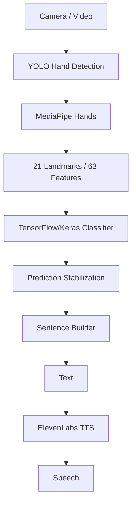

<p align="center">
  
</p>

# 🤟 Signify

**Sign Language → Text → Speech.**

Signify is a real-time sign language recognition app that turns hand gestures into spoken sentences. It combines YOLO, MediaPipe, TensorFlow/Keras, and ElevenLabs in a complete **sign → text → speech** pipeline.

---

## ✨ Features

* **Hand Detection** — YOLO localizes the hand before landmark extraction.
* **Landmark Extraction** — MediaPipe extracts 21 hand landmarks → 63 `(x, y, z)` features.
* **Sign Classification** — TensorFlow/Keras classifies signs using hand geometry.
* **Control Gestures** — Space, Delete, and Clear for real text composition.
* **Prediction Stabilization** — filters noisy frame-by-frame predictions before accepting a gesture.
* **Sentence Builder** — maintains the generated sentence as gestures are accepted.
* **Text-to-Speech** — ElevenLabs converts the generated sentence into speech.
* **Streamlit App** — supports live camera translation and video upload.
  
---

## 🎥 Demo

<p align="center">
  <a href="https://youtu.be/ophcqIxg8wc" target="_blank">
    
  </a>
</p>

<p align="center">
  <em>Watch Signify recognize hand gestures, build text, and convert the generated sentence into speech.</em>
</p>

---

## 🧭 The Journey

**We started with YOLO.** Our first attempt treated sign recognition as direct object detection: point YOLO at a hand and have it output the letter.

**YOLO wasn't enough.** Visually similar signs kept getting confused — asking a detector to classify an entire image of a hand, including background, lighting, skin tone, and angle, was harder than it needed to be.

**We changed the representation — and the question.** Instead of classifying raw pixels, we extracted the hand's geometry: 21 landmarks per hand via MediaPipe.

We didn't just change the model — we changed the question, from:

> *"Which letter is this image?"*

to:

> *"What is the geometric configuration of this hand?"*

Landmarks provide a compact, appearance-independent representation and reduce the classifier's dependence on how the hand actually looks in the frame.

**The model evolved.** The first landmark classifier was built in PyTorch (`landmark.pt`). It was later migrated to TensorFlow/Keras (`landmark_model.keras`), which is what the application uses today.

**YOLO came back — with a new job.** Once landmarks proved to be the better recognizer, YOLO found a new role: detecting the hand and cropping the region of interest before landmark extraction.

> **We didn't abandon YOLO; we changed its job.**

**The dataset fought back.** The dataset's class ordering didn't match the mapping we needed. A classifier's numeric output is meaningless without the correct index-to-letter mapping, so we corrected this and now track it explicitly in `class_mapping.json` and `landmark_meta.json`.

**Letters weren't enough.** Recognizing isolated letters isn't the same as writing text, so we added three control gestures — **Space, Delete, and Clear** — to turn letter recognition into an actual text-input system.

**From predictions to sentences.** Live video produces predictions every frame, and individual frames can be noisy. A stabilizer sits between raw predictions and the sentence builder, so a gesture is only accepted once it is stable and confident enough.

**From sentences to speech.** The finished sentence is passed to ElevenLabs for text-to-speech, and the entire pipeline is wrapped in a Streamlit application — taking Signify from research experiments to a usable **sign → text → speech** system.

---

## 🏗️ Architecture



---

## 🔄 How It Works

| Stage                     | What happens                                                                   |
| ------------------------- | ------------------------------------------------------------------------------ |
| **Input**                 | Camera stream or uploaded video is read frame by frame.                        |
| **Hand Detection**        | YOLO locates and crops the hand region.                                        |
| **Landmark Extraction**   | MediaPipe extracts 21 landmarks, producing 63 `(x, y, z)` features.            |
| **Classification**        | The Keras model predicts a letter or control gesture from the landmarks.       |
| **Stabilization**         | Predictions must remain stable and confident enough before being accepted.     |
| **Sentence Construction** | Accepted gestures add a character, add a space, delete, or clear the sentence. |
| **Text-to-Speech**        | The completed sentence is sent to ElevenLabs and converted into speech.        |

---

## 🔤 Supported Signs

Signify recognizes all **26 letters of the ASL alphabet (A–Z)**, along with **3 control gestures** used to build and edit the generated sentence.

[](assets/Gestures.png)

---

## 🛠️ Tech Stack

| Technology             | Role                              |
| ---------------------- | --------------------------------- |
| **YOLO / Ultralytics** | Hand detection and ROI extraction |
| **MediaPipe Hands**    | 21-point hand landmark extraction |
| **TensorFlow / Keras** | Current landmark-based classifier |
| **PyTorch**            | Earlier landmark classifier       |
| **Streamlit**          | Web application and interface     |
| **ElevenLabs**         | Text-to-speech                    |
| **Python**             | Core development language         |

---

## 📊 Model / Evaluation

### Overall Performance

Evaluated on a held-out test set of 279 samples across 26 ASL letters + 3 control gestures (Delete, Clear, Space).

| Metric | Score |
|---|---|
| Test Accuracy | **93.55%** |
| Macro Precision | 91.81% |
| Macro Recall | 91.68% |
| Macro F1 | 90.87% |
| Weighted Precision | 94.59% |
| Weighted Recall | 93.55% |
| Weighted F1 | 93.49% |

Macro F1 (90.87%) trails weighted F1 (93.49%) by about 2.6 points — a sign that low-support classes pull the unweighted average down more than overall accuracy suggests. **G** and **L** are the clearest examples: with only 3 test samples each, a single misclassification swings their F1 dramatically, so those scores should be read with wide error bars rather than as stable estimates.

The weakest *recall* scores — **U** (0.57) and **E** (0.67) — point to genuine confusion rather than a support artifact, since both classes have a typical sample count in line with the rest. Both letters share a closed-fist handshape with subtle finger positioning differences, which likely makes them harder to separate in landmark space than in raw pixels. This is a natural next target for either more training samples or additional discriminative features (e.g. finger-tip angles) rather than a labeling or data bug.

### Per-Class Performance

| Class | Precision | Recall | F1 |
|---|---|---|---|
| A | 0.75 | 1.00 | 0.86 |
| B | 1.00 | 1.00 | 1.00 |
| C | 1.00 | 1.00 | 1.00 |
| D | 1.00 | 1.00 | 1.00 |
| E | 1.00 | 0.67 | 0.80 |
| F | 0.80 | 0.80 | 0.80 |
| G | 0.67 | 0.67 | 0.67 |
| H | 1.00 | 1.00 | 1.00 |
| I | 1.00 | 0.88 | 0.93 |
| J | 1.00 | 1.00 | 1.00 |
| K | 0.83 | 1.00 | 0.91 |
| L | 0.60 | 1.00 | 0.75 |
| M | 1.00 | 0.83 | 0.91 |
| N | 1.00 | 1.00 | 1.00 |
| O | 0.70 | 1.00 | 0.82 |
| P | 1.00 | 0.85 | 0.92 |
| Q | 1.00 | 0.89 | 0.94 |
| R | 1.00 | 0.88 | 0.93 |
| S | 0.93 | 1.00 | 0.97 |
| T | 0.91 | 1.00 | 0.95 |
| U | 1.00 | 0.57 | 0.73 |
| V | 1.00 | 1.00 | 1.00 |
| W | 0.83 | 1.00 | 0.91 |
| X | 0.89 | 1.00 | 0.94 |
| Y | 1.00 | 0.75 | 0.86 |
| Z | 0.88 | 0.88 | 0.88 |
| Delete | 0.94 | 1.00 | 0.97 |
| Clear | 0.96 | 1.00 | 0.98 |
| Space | 0.93 | 0.93 | 0.93 |

### Training Curves


### Confusion Matrix


### Confidence Threshold Sweep


> Exact accuracy, precision, recall, and F1 scores for the current Keras model are not included yet. They should be added once the final evaluation is available rather than estimated.

---

## 📁 Project Structure

```text
.
│
├── app/
│   ├── main.py                         # Streamlit application entry point
│   └── backend.py                      # App backend + ElevenLabs TTS integration
│
├── assets/
│   ├── Logo.png
│   └── Gestures.png
│
├── models/
│   ├── landmark_model.keras            # Current classifier
│   ├── landmark.pt                     # Earlier PyTorch classifier
│   ├── landmark_meta.json               # Classifier metadata
│   ├── class_mapping.json              # Class index → letter/gesture mapping
│   └── yolo_best_weights (50 epoch).pt # YOLO hand-detector weights
│
├── notebooks/
│   ├── train_landmark.ipynb             # Landmark classifier training
│   └── train_yolo_best.ipynb            # YOLO detector training
│
├── outputs/
│   ├── confidence_threshold_sweep.png
│   ├── confusion_matrix.png
│   ├── landmark_extraction_failures.csv
│   ├── landmarks_dataset.npz
│   └── training_curves.png
│
├── presentations/
│   └── README.md
│
├── signlens/
│   ├── yolo_detector.py                # YOLO hand detection
│   ├── landmark.py                     # MediaPipe landmark extraction/normalization
│   ├── recognizer.py                   # TensorFlow/Keras classifier
│   ├── stabilizer.py                   # Prediction stabilization
│   ├── sentence.py                     # Sentence construction
│   └── pipeline.py                     # Full pipeline orchestration

│
├── .env.example
├── requirements.txt
├── LICENSE
└── README.md
```

---

## ⚙️ Setup

### 1. Clone the repository

```bash
git clone https://github.com/Usf132/Signify.git
cd Signify
```

### 2. Install dependencies

```bash
pip install -r requirements.txt
```

### 3. Configure ElevenLabs

Create a `.env` file based on `.env.example` and add your ElevenLabs API key.

```bash
cp .env.example .env
```

---

## ▶️ Usage

Start the Streamlit application:

```bash
streamlit run app/main.py
```

Open the application and choose between:

* **Live camera translation**
* **Video upload**

Recognized gestures are stabilized and converted into characters and control actions, building a sentence on screen.

Once the sentence is ready, it can be converted to speech using ElevenLabs.

---

## ⚠️ Limitations

* Recognition quality depends on hand visibility, lighting, camera angle, and image quality.
* The vocabulary is limited to the **ASL alphabet + 3 control gestures**.
* Full sign language — including words, grammar, facial expressions, and body movement — is out of scope.
* Prediction stabilization introduces a short, intentional delay before a gesture is accepted.
* Current metrics reflect a single train/test split and are not an independently vetted evaluation.
* The system is designed for isolated hand gestures rather than continuous natural sign-language sentences.

---

## 📚 Dataset & Acknowledgments

**Dataset:** *Add dataset source/link once available.*

Signify is built with the help of:

* [Ultralytics YOLO](https://github.com/ultralytics/ultralytics)
* [MediaPipe](https://developers.google.com/mediapipe)
* [TensorFlow / Keras](https://www.tensorflow.org/)
* [ElevenLabs](https://elevenlabs.io/)
* [Streamlit](https://streamlit.io/)

---

## 👥 Contributors

| Name                | GitHub                                       | LinkedIn                                                                 |
| ------------------- | -------------------------------------------- | ------------------------------------------------------------------------ |
| **Beshoy Karam**    | [@beshoy1612](https://github.com/beshoy1612) | [beshoy-karam](https://www.linkedin.com/in/beshoy-karam)                 |
| **Mohamed Mokhtar** | [@Mo5tar2005](https://github.com/Mo5tar2005) | [mohamed-mokhtar](https://www.linkedin.com/in/mohamed-mokhtar-881347401) |
| **Youssef Saad**    | [@Usf132](https://github.com/Usf132)         | [youssef-saad-dev](https://www.linkedin.com/in/youssef-saad-dev)         |
| **Yusuf Mustafa**   | [@Draken4-4](https://github.com/Draken4-4)   | [yusuf-mustafa](https://www.linkedin.com/in/yusuf-mustafa-aa7188352)     |

---

## 📄 License

Licensed under the [MIT License](LICENSE).
